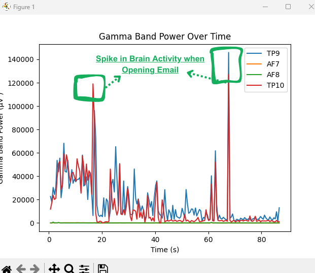

# BrainWave SVM: Brainwave-Based Excitement Detection

### Overview
BrainWave SVM is a data analysis and classification project that aims to detect whether a person is in an excited or neutral state using brainwaves collected from a Muse S headband. The project uses Python, pylsl for data collection, various libraries for data analysis, and a Support Vector Machine (SVM) for classification. The underlying goal is to demonstrate how real-time brainwave monitoring can facilitate decision-making, such as in marketing, consultations, or personal wellness tracking.

### Spike in Brain Activity After Opening Email
- The image below is the spike in my 'PERSONAL' brain activity, after I saw 2 unread emails, at 2 different points in time:
 

### Data Acquisition
1) Equipment: Muse S headband (other Muse headsets may also work but may produce slightly different data formats).
Libraries: pylsl (Python LSL) for streaming EEG data into Python.
2) Script:
    - data_collection.py uses pylsl to connect to the Muse S headband and record 5 brainwave frequencies (e.g., alpha, beta, gamma, delta, theta) from 4 different electrode locations on the scalp.
    - The script then saves these to a CSV file for each individual in both neutral and excited states.
3) Data Format:
    - The script stores data in .xlsx File and .csv files
    - Each row in the orignal_data.csv typically contains 20 feature values (5 frequency bands * 4 channels).

### Feature Extraction
1) Frequency Bands: The project analyzes five primary brainwave frequencies: alpha, beta, gamma, delta, and theta.
2) Channels: Muse S typically measures from multiple electrode sites. The script aggregates these by channel (tp9, af7, af8, tp10)
3) Feature Engineering:
    - Normalize Signal Values

### Statistical Analysis
1) Two Tailed Welch's T-Test:
    - A t-test is run on each of the 20 feature values to compare the neutral and excited states.
    - This step identifies which features are statistically significant in distinguishing between the two states.
2) Feature Selection:
    - Retain only the top significant features for the classification model.
    - This helps to reduce noise and improve model performance.

Analysis can be found in data_analysis.ipynb.

### Model Training
1) Classifier: A Support Vector Machine (SVM) is used to classify new observations into excited (1) or neutral (0).
2) Training: We use LeaveOneOut cross-validation when training the model
3) Accuracy: The Model achieved an accuracy of 0.9